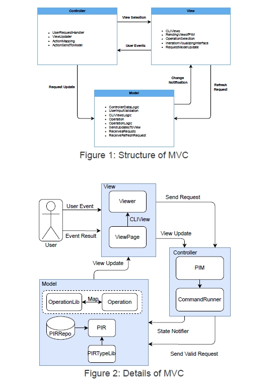
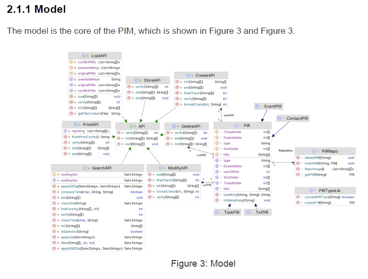
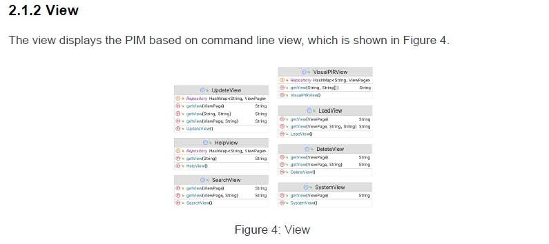
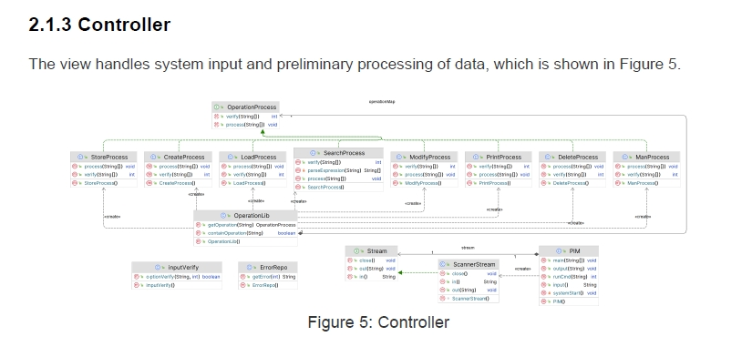
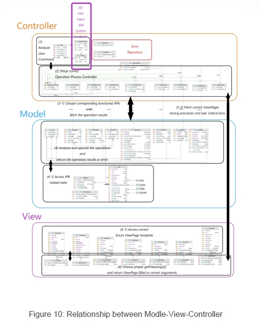
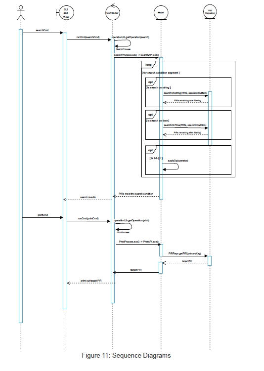

# Personal Information Manager
- strict MVC (Model-View-Controller)
- Software Requirements Specification, Design Document, Developer Manual and User Manual is in the document folder

# MVC PIM Achitecture

# Class Diagram

# Communications between Modle, View, and Controller

# PIM Sequance Diagram

# Demo Video
https://github.com/tyAlexios/PIM-MVC/assets/90125810/3acafd77-0357-4e9d-9ba3-5d505aeff55c

